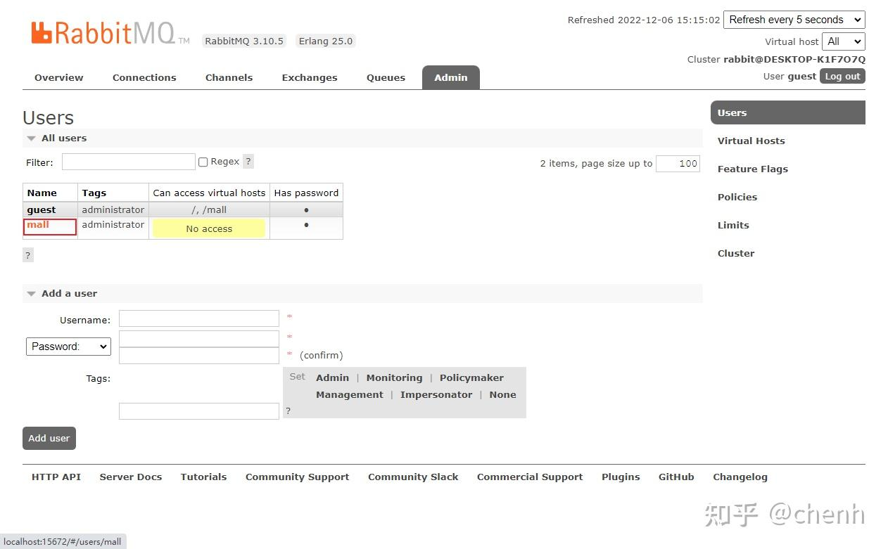

# 通过Docker-compose部署

## 1.环境部署
### 1.1生成环境镜像
移动compose文件，然后
`docker-compose -f docker-compose-env.yml up -d`


```SHELL
建议对mydata文件
chmod 777 ./mydata

```

### 1.3对容器配置

**Nginx**

需要拷贝nginx配置文件，否则挂载时会因为没有配置文件而启动失败。

```bash
# 创建目录之后将nginx.conf文件以及mime.types上传到该目录下面
mydata/nginx/conf/
```


**LogStash**

- 将logstash.conf移动到  `mydata/logstash/`

- 需要安装`json_lines`插件，并重新启动。

```bash
docker exec -it logstash /bin/bash
logstash-plugin install logstash-codec-json_lines
docker restart logstash
```


**MySQL**

- 进入mysql容器并执行如下操作：

```bash
#进入mysql容器
docker exec -it mysql /bin/bash
#连接到mysql服务
mysql -uroot -proot --default-character-set=utf8
#创建远程访问用户
grant all privileges on *.* to 'reader' @'%' identified by '123456';
#创建mall数据库
create database mall character set utf8;
#使用mall数据库
use mall;
#导入mall.sql脚本
source /mall.sql;
```

**MongoDB**


**RabbitMQ**

1,RabbitMQ创建帐号mall:mall，并设置其角色为管理员；

2,创建一个新的虚拟host为，名称为/mall；

3,点击mall用户进入用户配置页面；

给mall用户配置该虚拟host的权限，至此，RabbitMQ的配置完成。


**ES**
ES 需要安装ik分词器到 plugins

这里解压复制文件夹到` mydata/elasticsearch/plugins/ `

**Nacos**

导入压缩包


### 安装完毕

前端访问后推荐俩账号
macro:macro123
admin:macro123